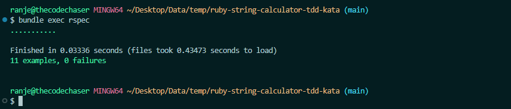
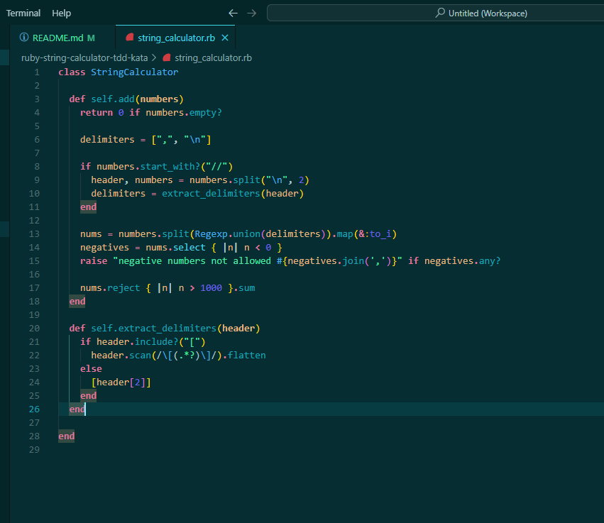
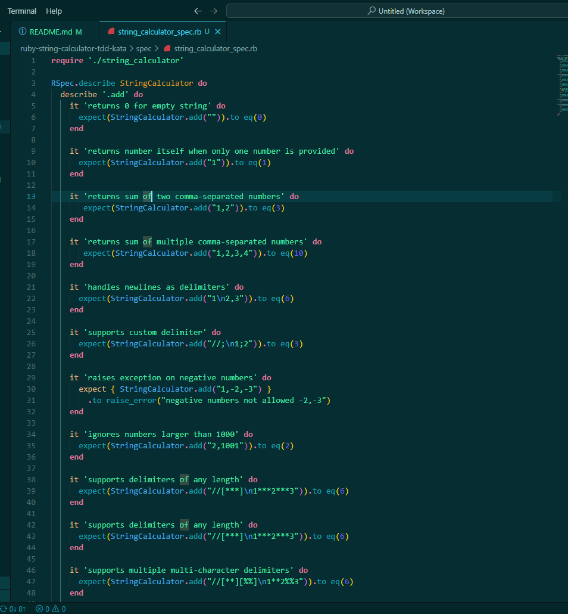

# Ruby String Calculator TDD Kata

> This is a TDD implementation of the classic **String Calculator Kata** using Ruby and RSpec.

## Built With

- Ruby
- Rspec

## Requirements

- Ruby (>= 2.7)
- Bundler

## Getting Started

To get a local copy up and running follow these simple example steps.

### Prerequisites
- A text editor(preferably Visual Studio Code)

### Install
- [Git](https://git-scm.com/downloads)
- [Ruby](https://www.ruby-lang.org/en/downloads/)

### Using it Locally

- Clone the project

```bash 
git clone git@github.com:thecodechaser/ruby-string-calculator-tdd-kata

cd ruby-string-calculator-tdd-kata
```

- Install dependencies

```bash
bundle install
```

- To run tests
```bash
bundle exec rspec
```

## Features Implemented
- Empty string returns 0
- Single number returns the number
- Two or more numbers comma-separated
- Newlines as valid delimiters
- Custom delimiters (e.g. //;\n1;2)
- Negative numbers raise an exception with the list
- Numbers greater than 1000 are ignored
- Delimiters of any length (e.g. //[***]\n1***2)
- Multiple custom delimiters (e.g. //[*][%])
- Multiple multi-char delimiters (e.g. //[**][%%])

## Screenshots







## Visit And Open Files

[Visit Repo](https://github.com/thecodechaser/ruby-string-calculator-tdd-kata)

## Download Repo

[Download Repo](https://github.com/thecodechaser/ruby-string-calculator-tdd-kata/archive/refs/heads/main.zip)

## Authors

👤 **Ranjeet Singh**

- Website: [thecodechaser.com](https://thecodechaser.com)
- GitHub: [@thecodechaser](https://github.com/thecodechaser)
- Twitter: [@thecodechaser](https://twitter.com/thecodechaser)
- LinkedIn: [thecodechaser](https://linkedin.com/in/thecodechaser)

## 🤝 Contributing

Contributions, issues, and feature requests are welcome!

Feel free to check the [issues page](https://github.com/thecodechaser/ruby-string-calculator-tdd-kata/issues).

## Show your support

Give a ⭐️ if you like this project!

## Acknowledgments

- Inspiration: IncuByte

## 📝 License

This project is [MIT](./LICENSE) licensed.
